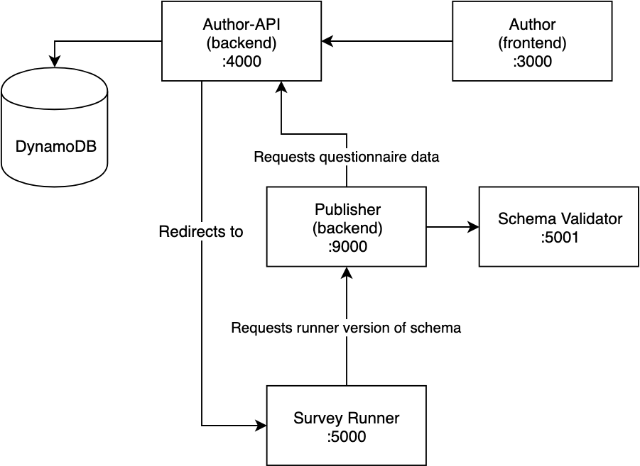

### EQ Compose

This Repo contains docker-compose scripts to launch EQ

To use these commands you will need to have Docker installed
https://docs.docker.com/docker-for-mac/install/

### Overview

Here are the various EQ services and how they relate to one another.



### Start all EQ services:
```
docker-compose -f eq.yml pull
docker-compose -f eq.yml up
```

### Stop all running services:
```
docker-compose -f eq.yml down
```

Below is a list of URLs for the services that will be started.

---
Service                                    | Description
-------------------------------------------|----------------------
eq-survey-register                         | http://localhost:8080
eq-survey-runner                           | http://localhost:5000
eq-survey-launcher                         | http://localhost:8000
eq-author                                  | http://localhost:3000
eq-author-api                              | http://localhost:4000
eq-publisher                               | http://localhost:9000

---
